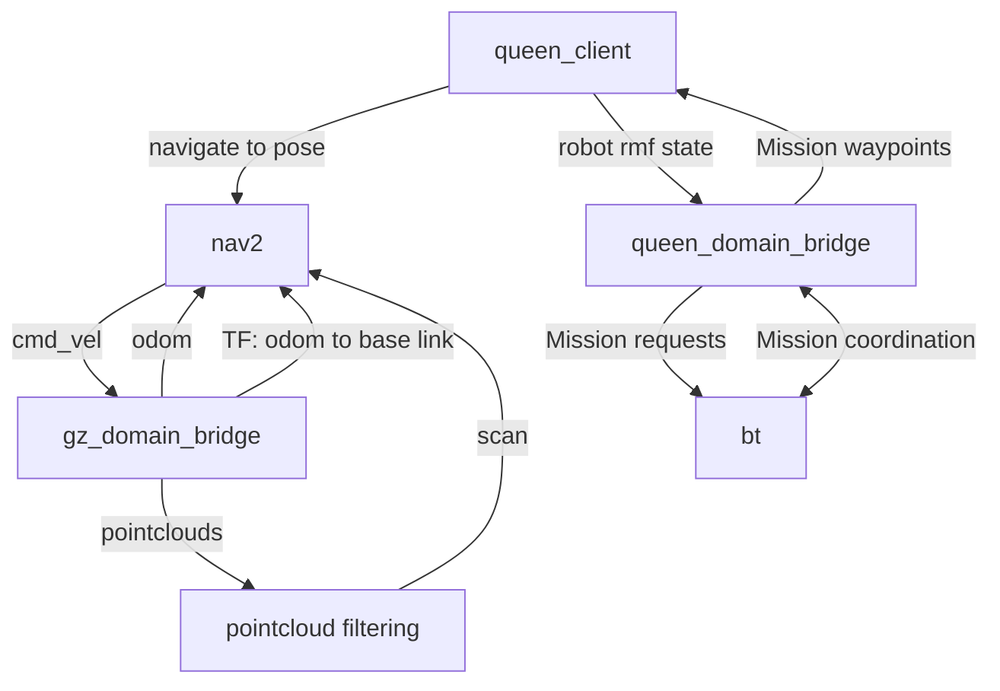

# Ant drone

The Ant Drone navigates through greenhouses, receives missions from the [Ant Queen](https://github.com/keenan88/ant-queen-ros2), and delivers [Ant Workers](https://github.com/keenan88/ant-worker-ros2) to piperails and chargers. 

## SLAM Startup - Simulation

1. Run `xhost +local:docker`.
2. Plugin the `Microsoft Corp. Xbox Wireless Controller (model 1914)` to the computer. 
3. Run `docker compose -f docker-compose.sim.slam_demo.yaml up`. The first time will take longer for the containers to build.
4. RVIZ2 will open a view of the robot, including its base frame, laser scans, and the map being generated.

6. Drive the robot around with the teleop terminal or xbox controller.
7. The map will expand as the robot drives around. The robot should stay well-localized to the map, and the scans should stay aligned to the map.
8. To save a map, run `docker exec -it antdrone0_slam` and `ros2 run nav2_map_server map_saver_cli -f /home/humble_ws/src/antdrone_slam/maps/`.
9. Be sure the robot is in the map bounds or the map will not save.
10. You can view your map in the [map folder](/antdrone_slam/maps/).
11. For compatability with RMF traffic maps, edit the map's yaml file to have its coordinates in the upper-left hand corner of the image.
12. Gimp can be used to cleanup any noise or moveable obstalces in the map, and rotate the map to be aligned with it's image coordinates.
13. Follow [this tutorial](https://docs.nav2.org/tutorials/docs/navigation2_with_keepout_filter.html) to add keepout zones to the map.

## Navigation Startup - Simulation

1. Run `xhost +local:docker`.
2. Plugin the `Microsoft Corp. Xbox Wireless Controller (model 1914)` to the computer. 
3. Run `docker compose -f docker-compose.sim.nav_demo.yaml up`. The first time will take longer for the containers to build.

5. Drive the robot around with the xbox controller. The robot should stay well-localizaed and the scans should stay aligned with the map.
6. Send a `2D Goal Pose` with Rviz. The robot will automatically drive itself to the goal position.

## High-level interaction with Queen

## Package Descriptions

### `antdrone_bringup`
Launch files to start drone subsystems.

### `antdrone_bt`
Behavior tree to organize drone actions and interact with Ant queen.
See further [documentation of the behavior tree](docs/bt.md).

### `antdrone_depth_to_laserscan`
Converts drone's 4 pointcloud streams to lidar scans, and merges them into a single scan for Nav2 AMCL and SLAM.

### `antdrone_description`
URDF description of drone. Very simple single box with 4 depth cameras and lib planar movement plugin.

### `antdrone_gz`
Spawn of drone for gazebo, including bridging and renaming topics from gazebo ros domain to drone's ros domain id.

### `antdrone_interfaces`
Datatypes used by the behavior tree for interacting with the queen.

### `antdrone_joystick`
Configuration file to drive the drone with a Microsoft Corp. Xbox Wireless Controller (model 1914).
Deadman switch is right bumper for translation movement and `B` for rotational movement.

### `antdrone_localization`
Generates wheel odometry in physical robot. Sim robot uses map -> odom TF provided by planar movement plugin.

### `antdrone_navigation`
Nav2 configuration for drone. Also has maps generated by slam.

### `antdrone_nicegui`
Simple UI to display drone data to a web interface.

### `antdrone_pcl`
Cropping and downsampling of pointclouds.

### `antdrone_queen_client`
Heartbeat ensures live communications with queen coordinator.
rmf_client accepts waypoint goals from RMF traffic management.

### `antdrone_slam`
Nav2 config for running SLAM to generate maps.

